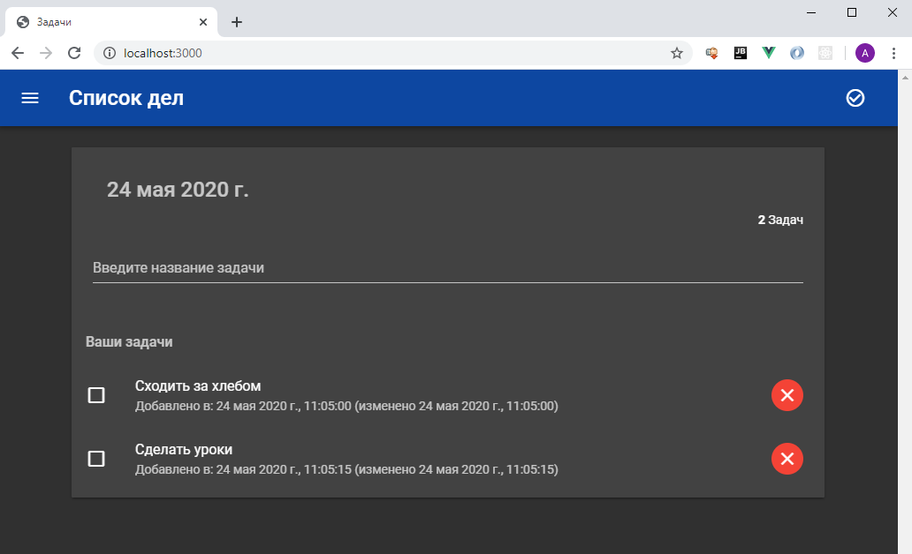

# Todo App
Второе приложение написанное в рамках учебного курса ["Node JS. Практический курс. (Mongo, GraphQL, MySQL, Express)"](https://www.udemy.com/course/nodejs-full-guide/).

Представляет из себя todo-список задач, использующий в качестве хранилища данных СУБД MySQL. В приложении реализовано REST API для получения/добавления/изменения/удаления задач. Клиентская часть реализована на Vue.js.

# REST API

| API                            | Описание                                               |
|:------------------------------:| ------------------------------------------------------ |
| GET    /api/todo               | Получение списка задач                                 |
| POST   /api/todo               | Добавление новой задачи. В теле: {"title":"название"}  |
| PUT    /api/todo/${id}         | Отметить задачу как выполненную. В теле: {"done":true} |
| DELETE /api/todo/${id}         | Удалить задачу                                         |

# Example
